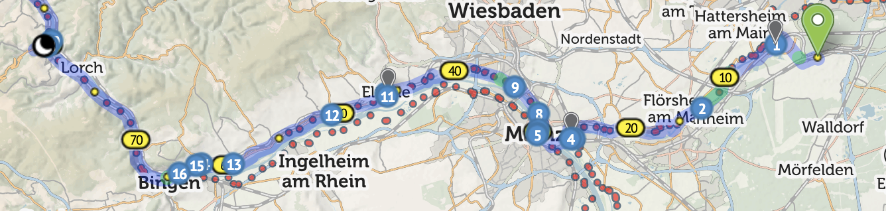
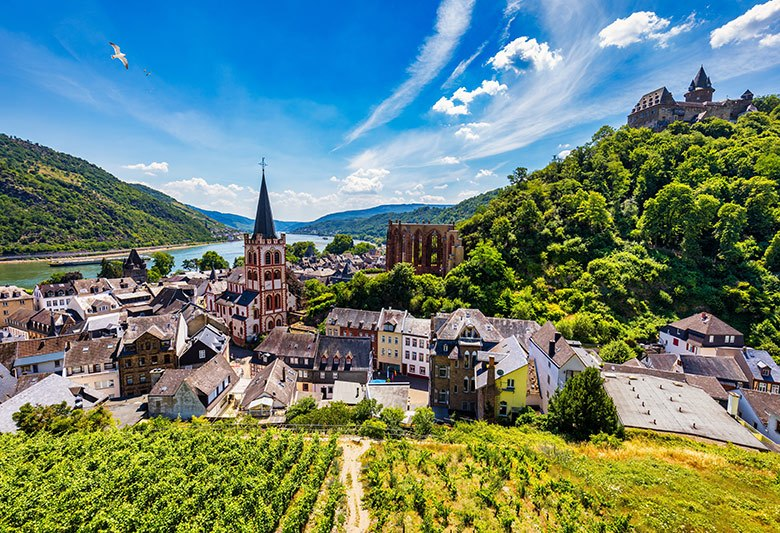
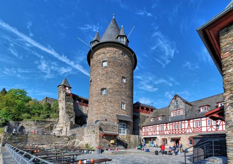
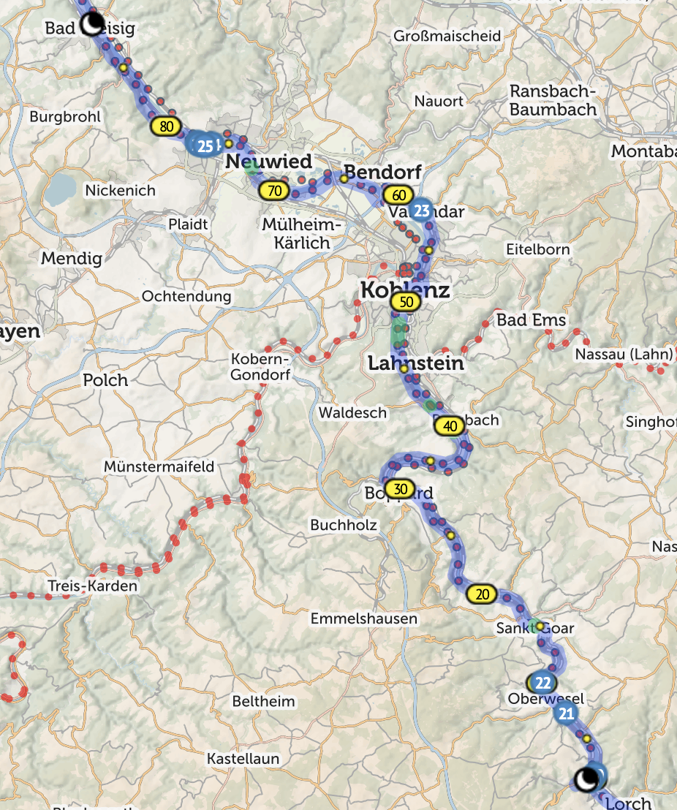
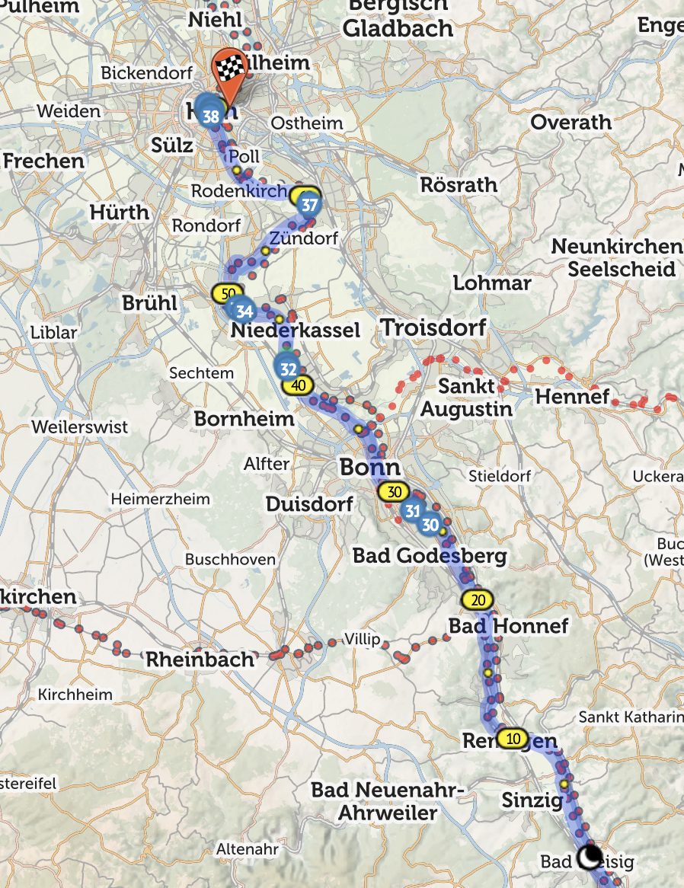
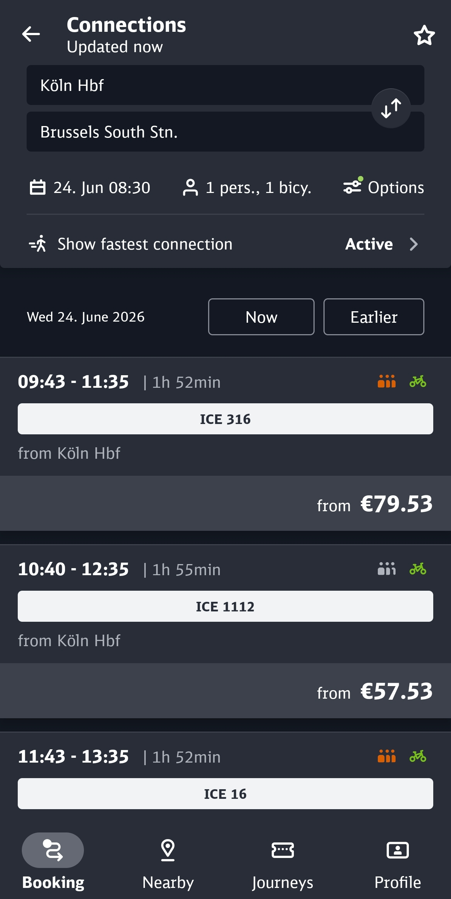
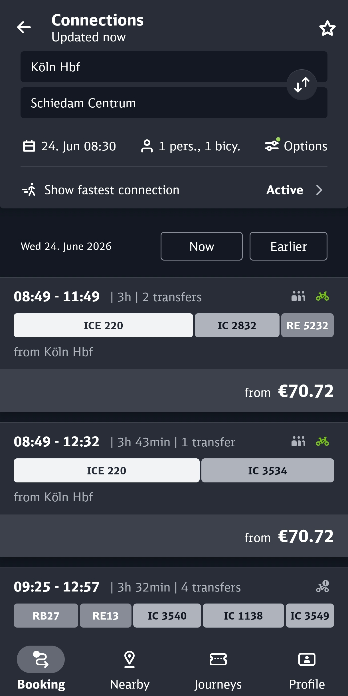
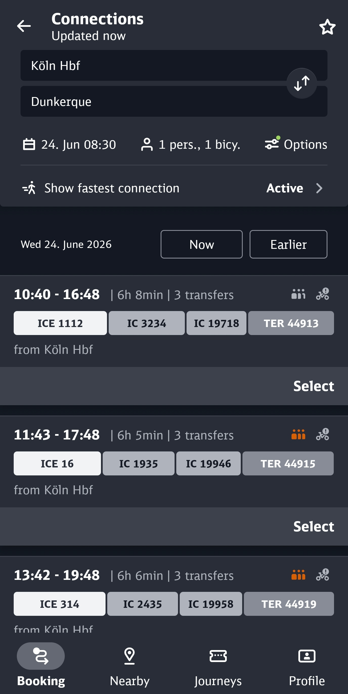

# 2027 Idea 1: OPERATION ROMANTIC

## Overview

*This is a flat route with only one, optional, climb.*

The ride starts on the banks of the River Main but after a short distance, we hit the River Rhine just as it enters the Mittelrhein Gorge - the Romantische Rhein.  We ride the length of the gorge and then enter the North German plane before the crazy architecture of Köln comes in to sight where we end the ride.

Germany has only existed as we know it since 1871.  Before then there was a loose collection of Dukedoms, Principalities, Electorates and the like, each a separate country with their own traditions, cuisines and governments. So, if you don't like the local beer, pedal 20kms and you'll get a completely different one - we'll also pass the palaces of a few of the minor states, sleep in a medieval castle, can take a dip in the river and view where the Valkyries played.

(We've actually ridden the final kilometres of the Rhine at Hoek van Holland)

The prices shown are short notice train fares - Deutsche Bahn increase prices nearer the time, so if we book as soon as they are available they should be cheaper.  Same with flights, I just chose a date to look at flight times.

Along the route are a number of Biergartens where we can stop for a Radler (shandy).  We'll be Fahrrad Fahren (Travel-wheel travelling - cycling) in some of the most stunning locations in Europe.  Quite often there's a town and then nothing for miles, so the stops will need to be dictated by availability rather than necessarily spaced out evenly like Belgium.

## Der Erste Tag

### Map

### Description

We start the ride from an airport hotel in the village of Kestlerbach from where we join [EuroVelo 4](https://en.eurovelo.com/ev4).  We've actually ridden two sections of EuroVelo 4 before - the Normandy and Dunkirk coastal routes.  We ride for about 20km until we reach the Rhine and [EuroVelo 15](https://en.eurovelo.com/ev15).  We cross the Rhine on a crazy train/cycle bridge in to the outskirts of the city of Mainz where our first stop of the day is.  We zig-zag across the Rhine to ensure we can see the best sites, visiting the outskirts of Wiesbaden entering the higher grounds of the gorge before having lunch at the town of Eltville.

In the afternoon, we enter the Gorge proper, sharing the bottom of the valley with a train line until a drinks stop at Bingen.  We then turn North heading towards our desination for the night Bacharach.  This town is the centre of wine making in the Rhine with some amazing wines to try in the shops of the town.

### Accomodation

We're aiming for [DJH Bacharach](https://www.jugendherberge.de/en/youth-hostels/bacharach/) - a hostel in a medieval castle (Schloß Berg Stahleck) on a hill overlooking the Rhine.

There's a [local taxi firm](https://www.rheintal-reisen.de/) that transports cyclists up the hill, those that fancy a challenge can pile your bags in the van and attack the hill like Eddie Merckx.

Bacharach has a number of fantastic restaurants or we can eat in the hostel.

## Der Zweite Tag

### Map

### Description

The route may look quite long, but the first 15km section from Bacharach to Sankt Goar is on a ferry - this is the famous Lorelei section, so to prevent a stop every 5 mins for photos, we're on an open topped ferry.  This also serves food, which is good as, Sonntag ist Ruhetag (rest day) and places are often closed.

We take a drink stop at Spay or Rhens before heading to  Koblenz, we pass the Deutches Eck (German corner) where the Maas/Meuse joins the Rhine and, if there's time, we can take a trip on the Seilbahn to the hill above and ride down.

A final drink stop at Andernach and a ride through the flower-lined streets bring us to the final hop of the day.  We then travel further along the gorge to Bad Hönig/Bad Breisag where we'll stay the night.  These are on opposite banks, so need to ensure we're on the correct bank. Bad means Bath, so they're both Spa towns.

### Accomodation

There are a number of hotels on both sides of the Rhine, the price seems to depend on how close to the river frontage you are. With a large group we may need to split between 2 hotels, hopefully on the same side of the river.

## Der Dritte Tag

### Map

### Description

We start the day riding through the final gorge stage to the Bridge at Remagen.  We then ride through the last of the gorge until we hit the outskirts of Bonn, the old capital of the Bundesrepublik Deutschland (West Germany) where we stop in the big out of town leisure area.

We carry on to Wesseling to grab some lunch and then hit the road for the final stretch.  We'll find a final 

With about 20km to go we enter Köln (Cologne), the largest city in Nordrhein-Westfalen (NRW) the final city of the trip.  We pass the Lindt Schokoladenmuseum before crossing in to the old town, passing Haus am 4711 (the original seller of Echt Kölnischer Wasser - Eau de Cologne).  Then up ahead, it appears, the Kölnischer Dom - the mother of all churches - it took 632 years to build, was the tallest building in the world when completed and was the only building left standing here in 1945. 

### Accomodation

Across the river by the Hohenzollernbrücke, the famous rail bridge, to the accomodation.  The main trade fair hall is in this area so there's a load of reasonable accommodation.  Dinner is back across the bridge on foot in one of the many restaurants on the Domplatz or near the Hauptbahnhof (train station).  One option is the [DJH Köln-Deutz](https://www.jugendherberge.de/en/youth-hostels/koeln-deutz/).

## Local Cuisine, Drinks etc.

During the initial part of the trip, we're riding through vineyards, with the town of Bacharach, our stop on night one, being the centre of Rhein viniculture.  Spätburgunder (Pinot Noir) and Riesling alongside Apfelwein (cider) are the local brews of choice.

Local Rhein food includes Nordhessische Ahle Wurst (dried sausages), Hummel und Erde (heaven and earth - potato dish), Pflaumenstreusel (Plum cake) and the amazing Sauerbraten mit Rosinen (marinated beef and raisins) and less amazing Handkäse (hand-cheese).

Later in the trip we exit the Rhein gorge and cross the hop country of NRW.  Here the local brew is Kölsch, served ice cold in a small tower glass.  Every time you put down an empty glass, a fresh one appears as if by magic, at the end of the night, the scores are totted up before you totter off home.  You can even get a knitted glass holder to keep your hands free.

Köln is also the home of the halbe hahn, it translates as half a chicken, but don't buy it expecting meat.  Don't worry though, there's a huge array of fantastic restaurants in the Altstadt near the Dom.

## Logistics 

### Gettng there

We go the night before - there are evening flights from Heathrow to Frankfurt am Main (if you fly to Frankfurt an Der Order, you're on you won, and on the Polish border).  After the Flugzeug (flying thing - aeroplane), 5 mins with the werkzeug (work thing - tools) and we have working bikes then head to an airport hotel.

Flying with bikes is really easy.  Get a large bike box for free from a local bike shop, drop the front wheel off, rotate the handlebars and pack it up. Plenty of padding and you're ready to go.  I've done it a couple of times and it's really easy.  You can even get the cycle shop at Heathrow to do it for you.

### Getting Back

There are four options for getting home.

#### Train to Brussels, then Eurostar.

Certain Eurostar services from Brussels to London allow unboxed bikes on them.  Booking has recently become easier you can now add bikes when booking (you used to book, then email to add the bike, if available).  There are hourly trains from Köln main station to Brussels.

#### Trains to Schiedam (change in Utrecht), then ride/Metro to Hoek van Holland and then Ferry.

#### Train to Dunkerque (change in Brussels and Lille) and ride to ferry.

#### Fly Köln-Bonn to Heathrow.
